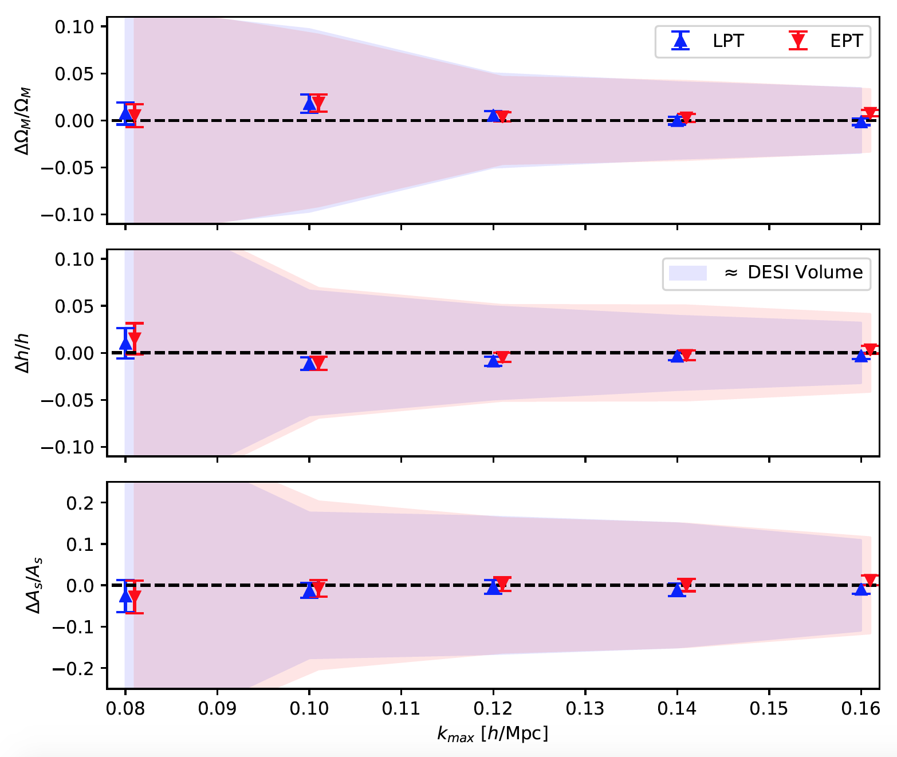

# velocileptors

Velocity-based perturbation theory (both Lagrangian (LPT) and Eulerian (EPT)
formulations) expansions of redshift-space distortions and
velocity statistics. 

This code computes the real- and redshift-space power spectra and
correlation functions of biased tracers using 1-loop perturbation
theory (with effective field theory counter terms and up to cubic
biasing) as well as the real-space pairwise velocity moments.

The code can be installed with

python3 -m pip install -v git+https://github.com/sfschen/velocileptors

It requires numpy, scipy and pyFFTW (the python wrapper for FFTW):

https://hgomersall.github.io/pyFFTW/

to run. Note that pyFFTW is pip and conda installable and available
from conda-forge (we have found the conda-forge channel to be the
most reliable).

An example calculation to reproduce the plots in the paper is given
in "Moment Expansion Example.ipynb".
A short notebook detailing the same steps for the Fourier Streaming Model
is given in "Fourier Streaming Model Example.ipynb".
Also included is "Gaussian Streaming Model Example.ipynb" that runs through
how to produce the correlation function multipoles.
An example of the most common use-cases is given in "lpt_examples.py".

For most situations computing the power spectrum wedges or multipoles
is as simple as:

```
from velocileptors.LPT.moment_expansion_fftw import MomentExpansion

mome        = MomentExpansion(klin,pklin,threads=nthreads)
kw,pkw      = mome.compute_redshift_space_power_at_mu(pars,f,mu,reduced=True)
kl,p0,p2,p4 = mome.compute_redshift_space_power_multipoles(pars,f,reduced=True)
```


The core rsd modules are distributed into two directories, one for
the LPT theory and one for the EPT theory (plus supporting routines
in the Utils directory). Running the EPT version of the above simply
requires substituting the "LPT" for "EPT" in the import statement,
though can be made more robust by supplying a cosmology-conscious 
no-wiggle power spectrum via the keyword pnw.
See the READMEs in those directories for more information.

For the most common case of computing the redshift-space power spectrum
one can use a a _reduced set_ of parameters and beyond_gauss=False:

pars = [b1, b2, bs, b3] +  [alpha0, alpha2, alpha4] +  [sn, sn2]

where

(1) b1, b2, bs, b3:  the bias parameters up to cubic order

(2) alpha0, alpha2, alpha4: counter terms of the form mu^n.

(3) sn, sn2: stochastic contributions to P_real(k), sigma^2
    [e.g. shot-noise, finger-of-god dispersion and kappa].


To include higher order terms in the moment expansion set beyond_gauss=True.
In this case you need to additionally specify an alpha6 counterterm and
an sn4 stochastic term.

You can also set the AP parameters using keywords apar and aperp.

-------

If you additionally want access to the velocity statistics, then the
full set of parameters is

pars = [b1, b2, bs, b3] +  [alpha, alpha_v, alpha_s0, alpha_s2, alpha_g1, alpha_g3, alpha_k2] +  [sn, sv, s0, s4]

where the parameters are:

(1) b1, b2, bs, b3: the bias parameters up to cubic order

(2) alpha, alpha_v, alpha_s0, alpha_s2, alpha_g1, alpha_g3, alpha_k2: the one-loop counterterms for each velocity component

(3) sn, sv, s0, s4: the stochastic contributions to the velocities

Again, for most practical purposes one can set beyond_gauss=False,
in which case the code only uses up to sigma(k), and uses a counterterm
ansatz for the third and fourth moments.
In this case the parameters alpha_g1, alpha_g3, alpha_k2, and s4 are not used.

More details can be found in Chen, Vlah & White (2020),
https://arxiv.org/abs/2005.00523
and Chen, Vlah, Castorina & White (2020),
https://arxiv.org/abs/2012.04636

---

In addition to the above there are two "direct expansion"
modules available in LPT and EPT. These are LPT.lpt_rsd_fftw
and EPT.ept_fullresum_fftw. The former is described in arXiv:2012.04636
while the latter is described in the original velocileptors paper
(arXiv:2005.00523). Both these models take the full bias vector

pars = [b1, b2, bs, b3] +  [alpha0, alpha2, alpha4, alpha6] +  [sn, sn2, sn4]

The LPT module has to be called slightly differently compared to the other ones because the angular dependence of the underlying IR resummation requires recomputing the PT integrals at each mu. For example the multipoles can be computed as:

```
from velocileptors.LPT.lpt_rsd_fftw import LPT_RSD
lpt = LPT_RSD(klin,plin,kIR=0.2)

lpt.make_pltable(f,nmax=4,apar=1,aperp=1)
kl,p0,p2,p4 = lpt.combine_bias_terms_pkell(pars)
```

Further calls, for example for wedges P(k,mu), can be found in the example notebooks.

---

The velocileptors code was entered into the [blind mock challenge](https://www2.yukawa.kyoto-u.ac.jp/~takahiro.nishimichi/data/PTchallenge/) described
[here](https://arxiv.org/abs/2003.08277).  We
summarize the results in the figure below, where the shaded regions are errors for a 5 (Gpc/h)^3 volume with the same signal.



---

This code is related to the configuration-space based code
https://github.com/martinjameswhite/CLEFT_GSM.

---

Much of the structure of this code is based on the earlier LPT code by Chirag Modi:

https://github.com/modichirag/CLEFT

which used the the mcfit class:

https://github.com/eelregit/mcfit

The main modification is that we save the Mellin transform kernels used in FFTLog to
save time, since they take more time than the fft's themselves to evaluate.
